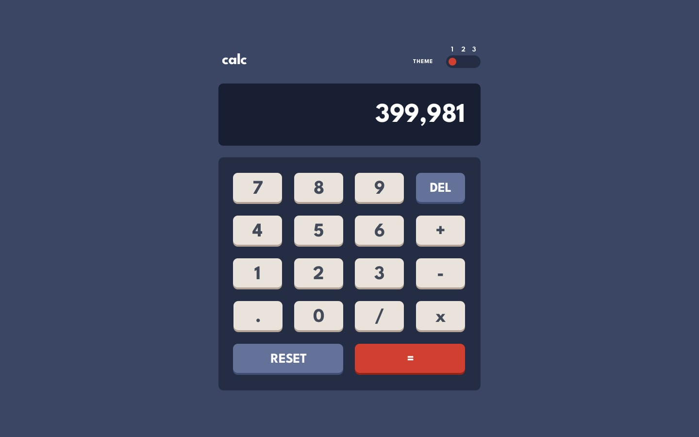
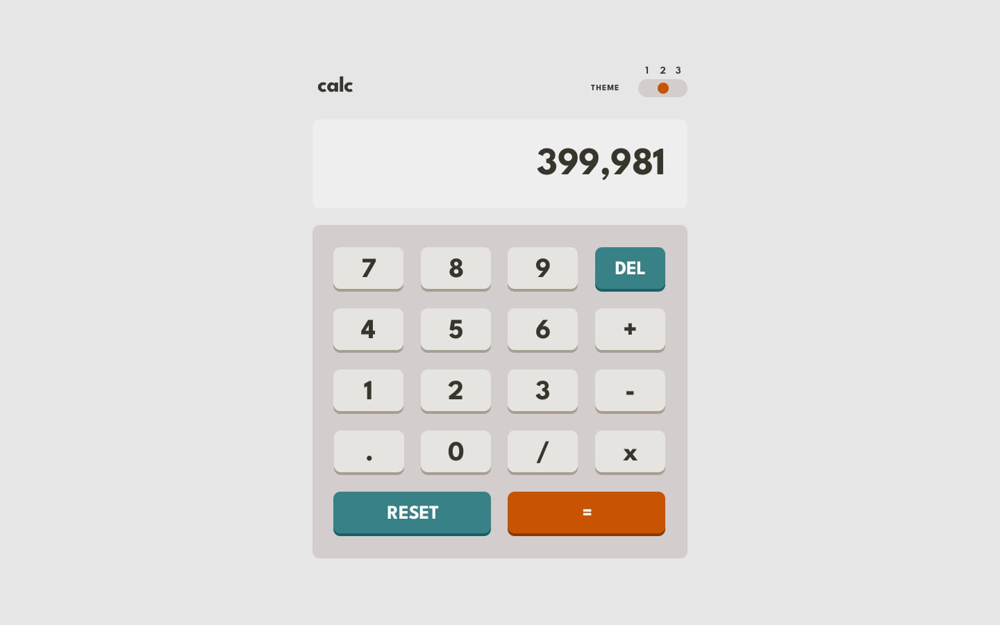
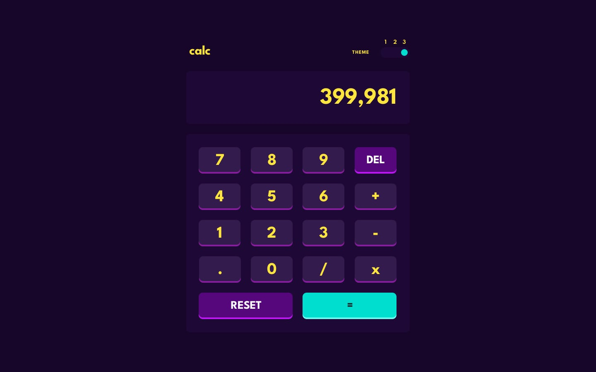

# 🧮  ماشین‌حساب

یک ماشین‌حساب کاملاً کاربردی با سه تم زیبا و تعاملات روان

---

### 📸 اسکرین‌شات‌ها

  <strong>تم 1 - روشن</strong> 
  

  <strong>تم 2 - تاریک</strong> 
  

  <strong>تم 3 - بنفش</strong> 
  

---

### ✨ ویژگی‌ها

- ✅ سه سبک تم زیبا
- ✅ نمایش محاسبه بلادرنگ
- ✅ دکمه‌های Clear (C) و Delete (DEL)
- ✅ دکمه Reset برای پاک‌سازی تمام
- ✅ مدیریت خطا برای عملیات نامعتبر
- ✅ پشتیبانی صفحه‌کلید برای محاسبات
- ✅ پشتیبانی اعداد اعشاری
- ✅ طراحی واکنش‌پذیر (موبایل، تبلت، دسکتاپ)
- ✅ Transitions و animations روان
- ✅ UI مدرن با استایل‌بندی حرفه‌ای

---

### 🛠️ تکنولوژی‌های استفاده‌شده

- HTML5 
- CSS3 (Custom Properties،  Tailwindcss v4، Themes)
- Vanilla JavaScript (ES6+)
- CSS Variables برای تبدیل تم
- GitHub Pages برای آپلود

---

### 🎯 پیاده‌سازی کلیدی

**سیستم تم:**
- سه طرح رنگی مختلف (روشن، تاریک، بنفش)
- CSS Custom Properties برای theming پویا
- ذخیره‌سازی تم انتخابی با localStorage
- Transitions روان رنگی بین تم‌ها
- Toggle برای تبدیل آسان تم

**منطق ماشین‌حساب:**
- تجزیه و ارزیابی عبارات ریاضی
- پشتیبانی برای محاسبات اعشاری
- کنترل تقدم عملگر
- مدیریت خطا برای عملیات نامعتبر
- به‌روزرسانی نمایش بلادرنگ

**رابط کاربری:**
- دکمه‌های بزرگ و کلیک‌پذیر
- صفحه‌نمایش واضح
- طرح‌بندی منظم دکمه (0-9، عملگرها)
- دکمه Delete (DEL) برای backspace
- دکمه Clear (C) برای بازنشانی عبارت
- تایپوگرافی حرفه‌ای

---

### 🙏 قدردانی‌ها

- چالش توسط [Frontend Mentor](https://www.frontendmentor.io?ref=challenge)

---

ساخته شده با 💙 توسط [Arvin Dev](https://github.com/Arvin-M-Dev)
